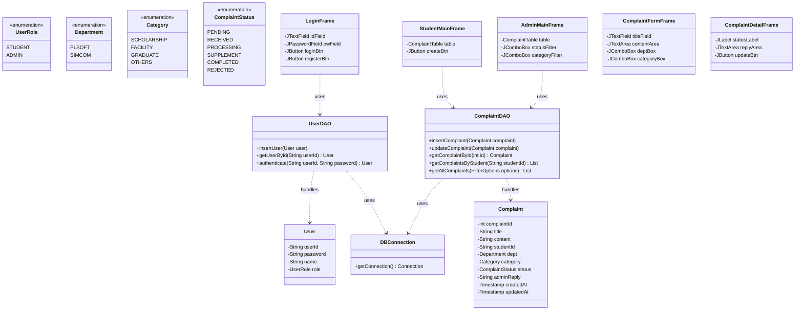

# CivilEase Class Diagram

## 패키지 구조 (Package Structure)

1.  **`com.civilease.model`**
    *   `User.java`, `Complaint.java` (DTO)
    *   `UserRole.java`, `Department.java`, `Category.java`, `ComplaintStatus.java` (Enums)
2.  **`com.civilease.dao`**
    *   `UserDAO.java`, `ComplaintDAO.java`
3.  **`com.civilease.view`**
    *   `LoginFrame.java`, `RegisterFrame.java`, `StudentMainFrame.java`, `AdminMainFrame.java`, `ComplaintFormFrame.java`, `ComplaintDetailFrame.java`
4.  **`com.civilease.util`**
    *   `DBConnection.java`
