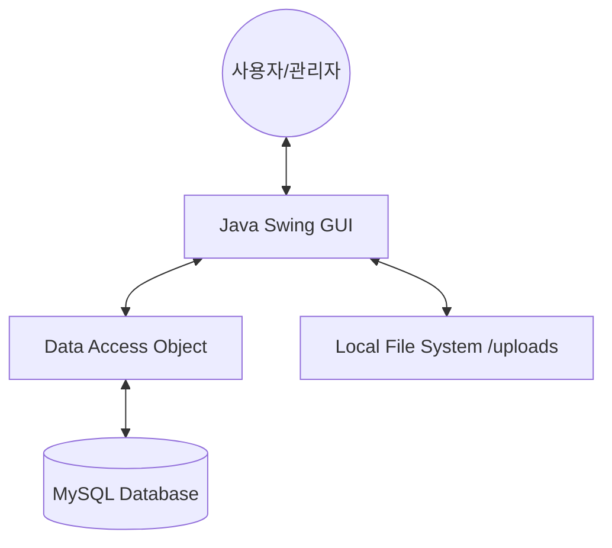
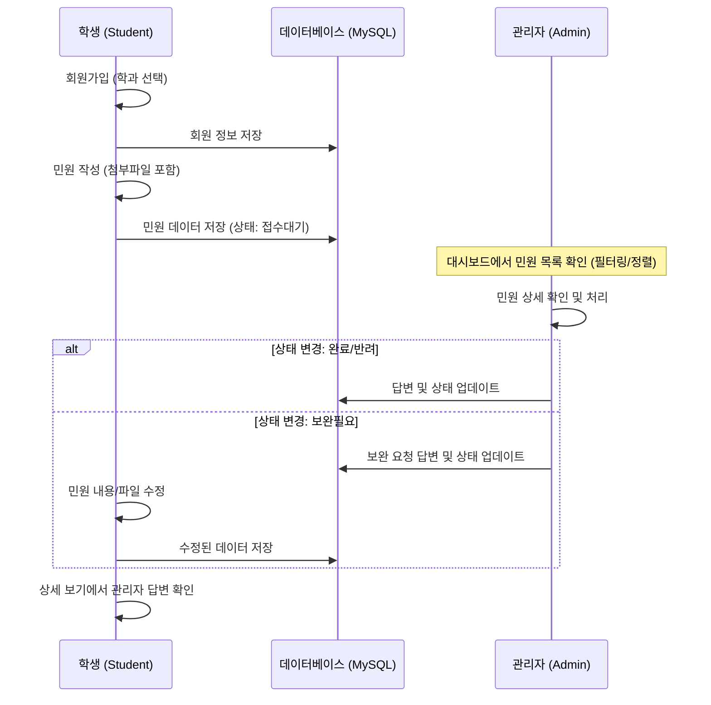
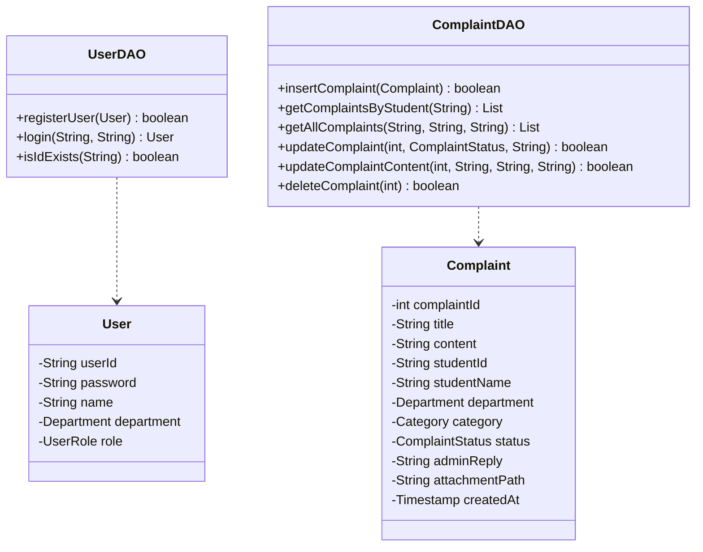

# CivilEase 프로젝트 발표 자료

## 1. 시스템 구성도 (System Architecture)
사용자(학생/관리자)가 Java Swing으로 구현된 GUI 인터페이스를 통해 시스템에 접속하며, 모든 데이터는 MySQL 데이터베이스에 영구적으로 저장됩니다.

---

## 2. 처리 흐름도 (Process Flowchart)
민원이 등록되고 관리자에 의해 처리되는 핵심 비즈니스 로직의 흐름입니다.

---

## 3. MVC 패턴 적용 (MVC Pattern)
본 프로젝트는 유지보수와 확장을 위해 **Model-View-Controller** 패턴의 구조를 따릅니다.

*   **Model (모델)**: 데이터를 담당하는 부분 (`com.civilease.model`)
    *   `User`, `Complaint`: 데이터 객체(DTO)
    *   `Department`, `Category`, `ComplaintStatus`: 상태 관리용 열거형(Enum)
*   **View (뷰)**: 화면 구성을 담당하는 부분 (`com.civilease.view`)
    *   `LoginFrame`, `RegisterFrame`, `StudentMainFrame`, `AdminMainFrame` 등
*   **Controller/DAO (컨트롤러)**: 비즈니스 로직 및 DB 연동 (`com.civilease.dao`)
    *   `UserDAO`: 사용자 인증 및 등록 처리
    *   `ComplaintDAO`: 민원 CRUD(생성, 조회, 수정, 삭제) 처리

---

## 4. 기능 명세서 (Functional Specification)

### 4.1 학생 (Student) 기능
| 기능명 | 상세 설명 |
| :--- | :--- |
| **회원가입** | 학번, 이름, 생년월일, 소속 학과를 입력하여 등록 |
| **로그인** | 학번과 생년월일(PW)을 통한 인증 |
| **민원 작성** | 제목, 내용 작성 및 카테고리 선택. 사진/PDF 파일 첨부 기능 |
| **민원 조회** | 본인이 작성한 민원 목록 및 실시간 처리 상태 확인 |
| **민원 취소** | '접수대기' 상태인 민원에 한해 삭제 가능 |
| **민원 수정** | 관리자가 '보완필요'로 설정한 경우 제목, 내용, 파일 재업로드 가능 |
| **답변 확인** | 상세 보기 창에서 관리자의 공식 답변 확인 |

### 4.2 관리자 (Admin) 기능
| 기능명 | 상세 설명 |
| :--- | :--- |
| **통합 관리** | 모든 학생이 제출한 민원을 한눈에 확인 |
| **필터링/정렬** | 카테고리별, 상태별 필터링 및 최신/과거순 정렬 기능 |
| **상태 관리** | 접수, 처리 중, 보완필요, 완료, 반려 등 6단계 상태 변경 |
| **답변 작성** | 각 민원에 대한 피드백 및 처리 결과 답변 등록 |
| **증빙 확인** | 학생이 첨부한 파일(이미지, PDF)을 즉시 열람 |

---

## 5. 클래스 다이어그램 (Class Diagram)

---

## 6. DB 테이블 설계 (Database Schema)

### 6.1 `users` 테이블 (사용자 정보)
| 컬럼명 | 데이터 타입 | 제약 조건 | 설명 |
| :--- | :--- | :--- | :--- |
| **user_id** | VARCHAR(20) | PRIMARY KEY | 학번 또는 관리자 ID |
| **password** | VARCHAR(100) | NOT NULL | 생년월일 또는 비밀번호 |
| **name** | VARCHAR(50) | NOT NULL | 이름 |
| **department** | ENUM | - | 소속 학과 (PLSOFT, SIMCOM) |
| **role** | ENUM | NOT NULL | 역할 (STUDENT, ADMIN) |

### 6.2 `complaints` 테이블 (민원 정보)
| 컬럼명 | 데이터 타입 | 제약 조건 | 설명 |
| :--- | :--- | :--- | :--- |
| **complaint_id** | INT | PRIMARY KEY, AI | 민원 고유 번호 |
| **title** | VARCHAR(200) | NOT NULL | 민원 제목 |
| **content** | TEXT | NOT NULL | 민원 내용 |
| **student_id** | VARCHAR(20) | FK (users) | 작성자 학번 |
| **department** | ENUM | NOT NULL | 관련 학과 |
| **category** | ENUM | NOT NULL | 민원 카테고리 |
| **status** | ENUM | Default 'PENDING' | 처리 상태 |
| **admin_reply** | TEXT | - | 관리자 답변 내용 |
| **attachment_path** | VARCHAR(500) | - | 첨부파일 저장 경로 |
| **created_at** | TIMESTAMP | Default NOW | 작성 일시 |
